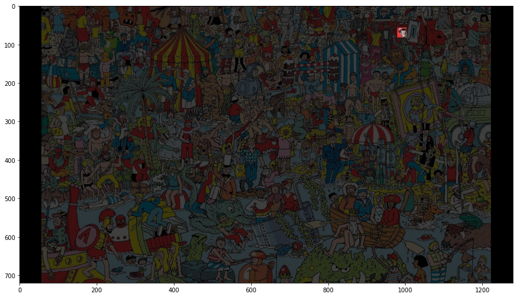
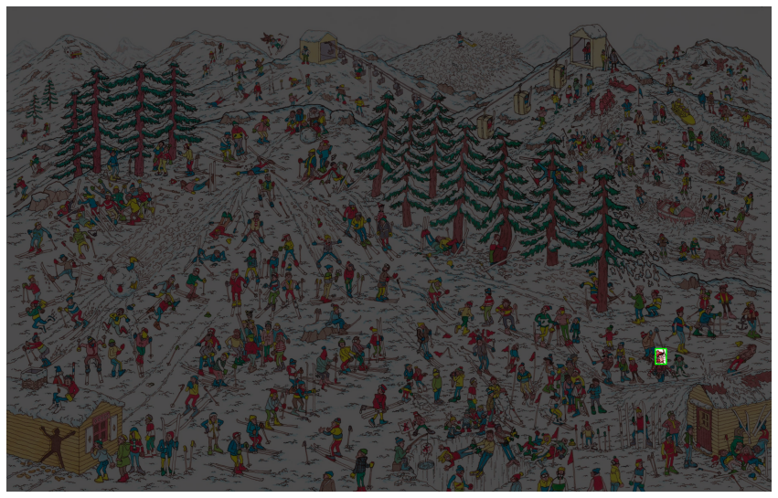
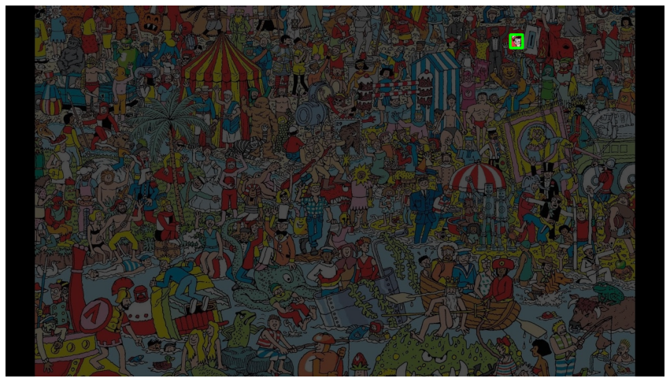

# Template-Matching
Template matching is a technique in digital image processing for finding small parts of an image which match a template image.

## Overview
The goal of this part is to build a template maching algorithm for where's waldo puzzle. 
The end product should be finding waldo in puzzle images. 

### Subpart 1: Template Matching with OpenCV
OpenCV provide Template Matching functions below link. 

https://docs.opencv.org/4.x/d4/dc6/tutorial_py_template_matching.html

You can use this function for implementing simple where's waldo algorithm.

This part helps you to understand the concepts of Template Matching and OpenCV Library. This is just for reference.

### Subpart 2: Template Matching from Scratch

Implement the Sum of Squared Distance (SSD) template matching algorithm from scratch (Don't use cv2.matchTemplate).

Then, show the results of where's waldo for two puzzle images.

Hints: You can borrow the codes from Part1 and Part2. Please read methods for matching with filters in Lecture Slide.  

# Usage
```
Run the TemplateMatching.ipynb file in Jupyter Notebook or Google Colab.
```

# Result

<table>
    <tr><td></td></tr>
    <tr><td></td></tr>
    <tr><td></td></tr>
</table>

# Folder Structure
```
📦Template-Matching
 ┣ 📂Results
 ┃ ┗ 📜output.png
 ┣ 📜.gitignore
 ┣ 📜LICENSE
 ┣ 📜README.md
 ┣ 📜Template_matching.ipynb
 ┣ 📜output_2.png
 ┗ 📜output_3.png
```